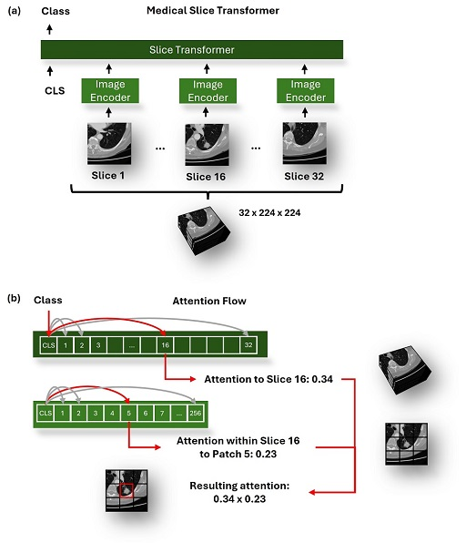

# Medical Slice Transformer: Improved Diagnosis and Explainability on 3D Medical Images with DINOv2 

Please see our paper:  https://doi.org/10.48550/arXiv.2411.15802

 
<b>Figure:  Overview of the Model Architecture and Attention Flow. </b>  (a) The Medical Slice Transformer framework processes individual MRI or CT slices using 2D image encoders, such as DINOv2, and then passes the encoded outputs through the Slice Transformer for downstream classification tasks.  (b) Visualization of attention mechanisms showing how the Slice Transformer assigns attention to specific slices and how within-slice attention is further refined to specific patches, resulting in a combined attention map highlighting regions of interest in the input volume. 

## Step 1: Setup 
* Clone this repository `git clone https://github.com/mueller-franzes/MST`
* Run: `conda env create -f environment.yaml` 
* Run `conda activate MST`

## Step 2: Setup Data

### Option A: Public Data 
* Download data (use 'Classic Directory Name' for TCIA):
   * [LIDC-IDRI](https://www.cancerimagingarchive.net/collection/lidc-idri/)
   * [DUKE](https://www.cancerimagingarchive.net/collection/duke-breast-cancer-mri/)
   * [MRNet](https://stanfordmlgroup.github.io/competitions/mrnet/)
* Follow preprocessing steps in [scripts/preprocessing](scripts/preprocessing)

### Option B: Private Data
* Add your own dataset to [mst/data/datasets](mst/data/datasets)
* Add your own dataset to `get_dataset()` in [scripts/main_train.py](scripts/main_train.py)  

## Step 3: Run Training
### Option A: Use Trained Models
Skip training and download the weights from [Zenodo](https://doi.org/10.5281/zenodo.14500631).
### Option B: Train Models
Run Script: [scripts/main_train.py](scripts/main_train.py)
* Eg. `python scripts/main_train.py --dataset LIDC --model ResNet`
* Use `--model` to select:
    * ResNet = 3D ResNet50, 
    * ResNetSliceTrans = MST-ResNet, 
    * DinoV2ClassifierSlice = MST-DINOv2  

## Step 4: Predict & Evaluate Performance
Run Script: [scripts/main_predict.py](scripts/main_predict.py)
* Eg. `python scripts/main_predict.py --run_folder LIDC/ResNet`
* Use `--get_attention` to compute saliency maps
* Use `--get_segmentation` to compute segmentation masks and DICE score 
* Use `--use_tta` to enable Test Time Augmentation 